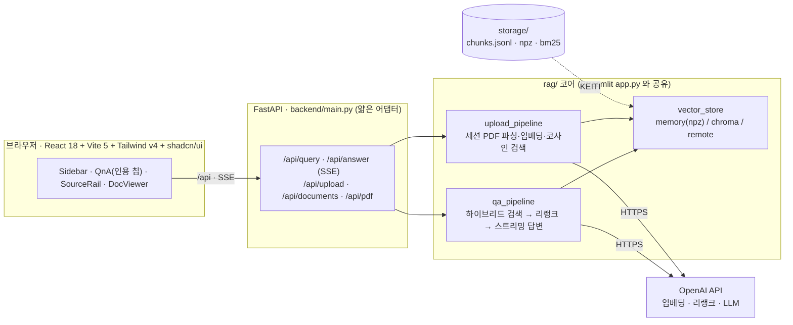
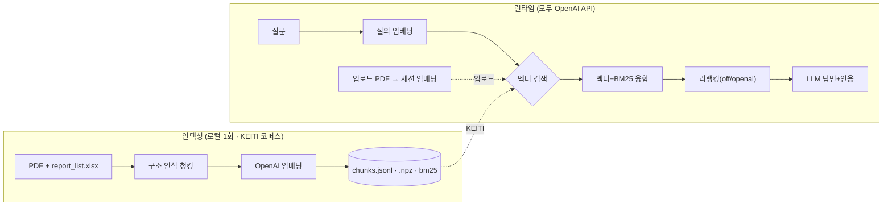
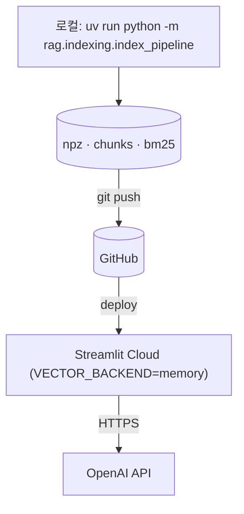

# 코네틱 보고서 Q&A (RAG)


KEITI(코네틱) 환경 보고서를 대상으로 한 한국어 RAG 질의응답 시스템.
질문하면 보고서 근거를 검색해 **출처·페이지를 인용한 답변**을 생성한다.

- **OpenAI 전용**: 임베딩·리랭킹·LLM 모두 OpenAI API. 로컬 모델(torch 등) 없음 → Streamlit Cloud 무료티어 배포 가능.
- **두 가지 사용 방식**
  - *KEITI 보고서*: 사전 인덱싱한 보고서 코퍼스를 질의(고정 지식 베이스).
  - *내 문서 업로드*: 올린 PDF 를 런타임에 파싱·임베딩(세션 메모리)해 질의.
- **BYOK**: 사용자가 사이드바에 본인 OpenAI 키를 입력. 키는 세션에만 보관(저장/로깅 안 함).

---

## 아키텍처

### 서비스 구성 — React + FastAPI (SSE 스트리밍)

`rag/` 코어는 하나이고, 두 프론트엔드(React+FastAPI / Streamlit)가 이를 공유한다.



### RAG 파이프라인 — 인덱싱(오프라인) · 런타임



### 배포 — Streamlit Cloud (인메모리 검색)



**교체 지점** — `RERANK_BACKEND`(off/openai), `VECTOR_BACKEND`(chroma 로컬 / memory 배포 / remote 원격). 임베딩·LLM 은 OpenAI 단일.

---

## 사전 요구사항

> 저장소를 처음 받는 동료라면 → **[docs/ONBOARDING.md](docs/ONBOARDING.md)** (Windows 포함 단계별 안내).

- **[uv](https://docs.astral.sh/uv/)**(Python 패키지 매니저) · **Python 3.10+**
- **Node 22**(React+FastAPI 버전을 쓸 때만)
- **OpenAI API 키** 1개 — 공용 키가 없으면 앱에서 각자 입력(BYOK)

```bash
git clone <repo-url> && cd konetic-report-rag
cp .env.example .env          # OPENAI_API_KEY 채우기 (없으면 앱에서 BYOK 입력)
```

---

## 빠른 시작 (uv)

clone 직후 `storage/` 인덱스가 커밋돼 있어 **재인덱싱 없이 바로 실행**된다(원본 PDF 불필요).

```bash
uv sync                       # 런타임 의존성 설치
uv run streamlit run app.py   # Streamlit → http://localhost:8501
```

**React + FastAPI 버전**(SSE 스트리밍)은 한 스크립트로 두 서버를 함께 띄운다:

```bash
./dev.sh                      # macOS/Linux — FastAPI(:8000) + Vite(:5173)
dev.bat                       # Windows     — 백엔드 새 창 + Vite
```

의존성이 없으면 스크립트가 자동 설치한다(프론트 `npm install`, 백엔드 `backend/requirements.txt`).
브라우저에서 http://localhost:5173 접속(`/api` → 8000 프록시). 상세는 [docs/REACT_FASTAPI.md](docs/REACT_FASTAPI.md).

### 포트 · 종료

| 서버 | 포트 | 개별 실행 | 종료 |
|------|------|-----------|------|
| Streamlit | 8501 | `uv run streamlit run app.py` | `Ctrl-C` |
| FastAPI | 8000 | `uv run uvicorn backend.main:app --reload --port 8000` | `Ctrl-C` |
| Vite(React) | 5173 | `cd frontend && npm run dev` | `Ctrl-C` |

> `dev.sh`는 Ctrl-C 한 번으로 두 서버를 함께 내린다. 포트 점유 시: `lsof -ti:8000 | xargs kill`(mac/Linux).
> 재인덱싱(원본 PDF/엑셀 필요): `uv sync --extra indexing` 후 `.env`에 `RAG_DATA_DIR` 지정 →
> `uv run python -m rag.indexing.index_pipeline`.

---

## 설정 (`.env` 로컬 / `st.secrets` 클라우드)

| 키 | 기본값 | 설명 |
|----|--------|------|
| `OPENAI_API_KEY` | — | 미설정 시 BYOK(사용자 입력) 필수 |
| `OPENAI_MODEL` | `gpt-5.4-nano` | 답변·리랭크 LLM |
| `OPENAI_EMBED_MODEL` | `text-embedding-3-large` | 임베딩(3072d) |
| `RERANK_BACKEND` | `openai` | `off` \| `openai` |
| `VECTOR_BACKEND` | `chroma` | `chroma`(로컬) \| `memory`(배포) \| `remote` |
| `LOG_LEVEL` | `INFO` | `DEBUG` 로 단계별 상세 로그 |

---

## 모듈 구조

```
app.py                  Streamlit 진입점 (2모드·BYOK·모니터)
rag/                    런타임 패키지
├─ config.py            설정 단일 출처(.env/secrets·경로·백엔드·가격표·로깅)
├─ services.py          OpenAI 클라이언트(키별)·임베딩·Chroma 클라이언트·BM25
├─ monitoring.py        서버 로깅 + 토큰/비용(USD) 추정
├─ vector_store.py      벡터 검색 추상화 — chroma / memory / remote
├─ qa_pipeline.py       검색 → 리랭킹 → LLM 답변 + 시간/토큰/비용 집계
├─ upload_pipeline.py   업로드 PDF 파싱·일반 청킹·세션 임베딩·코사인 검색
├─ preflight.py         환경 자가진단(storage/·키·원본데이터·프론트 실측 · 한국어 안내)
└─ indexing/            오프라인 인덱싱(배포 런타임 불필요)
   ├─ structure_chunker.py   KEITI 보고서 구조 인식 파싱·청킹
   ├─ index_pipeline.py      엑셀↔PDF 매핑 → 청킹 → 임베딩 → 적재
   ├─ build_openai_index.py  청크 재사용 재임베딩
   └─ export_npz.py          Chroma → npz 추출

backend/main.py         FastAPI — rag 파이프라인을 REST/SSE 로 노출 (얇은 어댑터)
frontend/               React 18 + Vite 5 + TS + Tailwind v4 + shadcn/ui
├─ src/main.tsx         React 진입점(App 마운트)
├─ src/App.tsx          레이아웃·상태 오케스트레이션 (3-zone)
├─ src/api.ts           REST/SSE 클라이언트(fetch 래퍼)
├─ src/types.ts         공유 타입(Source·Usage·ConfigInfo 등)
├─ src/index.css        디자인 토큰(@theme) — docs/DESIGN.md 팔레트 C
├─ src/hooks/           useAnswerStream — 스트리밍 상태머신(로직)
├─ src/lib/utils.ts     cn() 헬퍼(clsx + tailwind-merge)
└─ src/components/       Sidebar · SourceRail · DocViewer · UploadBar
   ├─ qa/               QnA · Citations(인용 칩) · ProcessDetail
   └─ ui/               shadcn 프리미티브(button · dialog)

docs/ONBOARDING.md      동료 온보딩 (git pull 후 처음 실행)
docs/DESIGN.md          디자인 시스템 단일 출처 (UI 결정 전 필독)
docs/REACT_FASTAPI.md   React+FastAPI 실행·배포 안내
```

> UI 스택은 React+FastAPI 버전 전용이다(`app.py` Streamlit 은 별개). 색·타이포·간격 등
> 모든 시각 결정은 [docs/DESIGN.md](docs/DESIGN.md)를 단일 출처로 삼는다.

---

## 배포 (Streamlit Cloud)

런타임은 OpenAI API + 인메모리(numpy) 검색만 쓰므로 무료티어에 그대로 올라간다.

1. 로컬에서 인덱싱(1회): `uv run python -m rag.indexing.index_pipeline`
   → `storage/{chunks.jsonl, reports_openai.npz, bm25_openai.pkl}` 생성(커밋 대상).
2. GitHub 푸시 → Streamlit Cloud → New app → **Main file: `app.py`** (Python 3.12 권장).
3. **Secrets** (앱 설정):
   ```toml
   OPENAI_API_KEY = "sk-공용키"     # 공용 키면 사이드바 입력칸 자동 숨김
   APP_PASSWORD   = "비밀번호"       # 공개 URL 남용 방지(권장)
   VECTOR_BACKEND = "memory"
   RERANK_BACKEND = "openai"
   OPENAI_MODEL = "gpt-5.4-nano"
   OPENAI_EMBED_MODEL = "text-embedding-3-large"
   ```
   - `OPENAI_API_KEY`를 빼면 BYOK(방문자가 각자 키 입력) 모드가 된다.
   - `chromadb` 미설치(슬림)면 `VECTOR_BACKEND`는 자동으로 `memory`로 폴백.
   - 대안: 로컬 Chroma 서버 + 터널(`VECTOR_BACKEND=remote`, `CHROMA_HTTP_*`)도 지원.

> 모니터링: 단계별 시간·토큰·비용은 서버 로그(`[rag] …`)와 UI에 표시. 가격표 `config.PRICES`는 추정치(실단가로 조정).

---

## 다음 작업 · 기여

우선순위·근거를 포함한 전체 로드맵은 [docs/PLAN.md](docs/PLAN.md) "진행 중 / 다음"에 정의돼 있다. 요약:

- **RAG 품질 튜닝** — 표/요약도 의미분할 대상 포함(현재 `body`만 분할).
- **React/FastAPI 운영화** — FastAPI 인증 게이트(`app.py`의 `APP_PASSWORD` 상당), 정적 빌드 서빙/프록시 배포.
- **동시 사용자** — `qa_pipeline`의 사용량 전역 변수 → 요청 로컬로 리팩터(현재 `_QUERY_LOCK` 직렬화).

PR을 열면 CI([`.github/workflows/ci.yml`](.github/workflows/ci.yml))가 백엔드 린트·임포트 스모크 /
프론트 빌드 / 맞춤법을 검증한다. 세션별 변경 이력은 [docs/LOGGING.md](docs/LOGGING.md).

---

## 라이선스 / 저작권

- **보고서 원문·데이터의 저작권은 한국환경산업기술원(KEITI, 코네틱)에 있다.** 이 저장소가 인덱싱·인용하는
  KEITI 환경·정책 보고서 및 그 발췌·표·각주의 모든 권리는 한국환경산업기술원에 귀속한다.
- 본 프로젝트는 해당 보고서를 대상으로 한 **비영리 연구·데모(PoC)** 목적의 검색·질의응답 도구이며,
  원문 저작권을 이전하거나 재배포 권한을 부여하지 않는다. 상업적 이용·재배포는 한국환경산업기술원의
  별도 허가가 필요하다.
- 답변에 포함된 인용은 항상 출처(문서·페이지)와 코네틱 원문 링크를 함께 제공해 원출처를 밝힌다.
