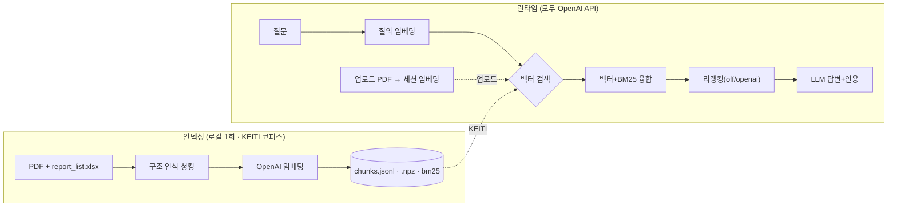
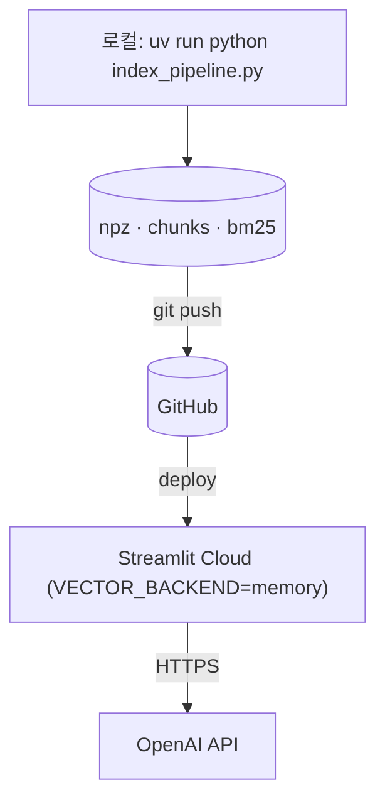

# 코네틱 보고서 Q&A (RAG)

KEITI(코네틱) 환경 보고서를 대상으로 한 한국어 RAG 질의응답 시스템.
질문하면 보고서 근거를 검색해 **출처·페이지를 인용한 답변**을 생성한다.

- **OpenAI 전용**: 임베딩·리랭킹·LLM 모두 OpenAI API. 로컬 모델(torch 등) 없음 → Streamlit Cloud 무료티어 배포 가능.
- **두 가지 사용 방식**
  - *KEITI 보고서*: 사전 인덱싱한 보고서 코퍼스를 질의(고정 지식 베이스).
  - *내 문서 업로드*: 올린 PDF 를 런타임에 파싱·임베딩(세션 메모리)해 질의.
- **BYOK**: 사용자가 사이드바에 본인 OpenAI 키를 입력. 키는 세션에만 보관(저장/로깅 안 함).

---

## 아키텍처





**교체 지점** — `RERANK_BACKEND`(off/openai), `VECTOR_BACKEND`(chroma 로컬 / memory 배포 / remote 원격). 임베딩·LLM 은 OpenAI 단일.

---

## 빠른 시작 (uv)

```bash
uv sync --extra indexing          # 런타임 + 인덱싱 의존성
uv run python index_pipeline.py   # KEITI 코퍼스 인덱싱 (청킹+임베딩+적재)
uv run streamlit run app.py       # http://localhost:8501
```

사이드바에 OpenAI 키를 입력하면 질의 가능(로컬은 `.env` 키로 폴백).

---

## 설정 (`.env` 로컬 / `st.secrets` 클라우드)

| 키 | 기본값 | 설명 |
|----|--------|------|
| `OPENAI_API_KEY` | — | 미설정 시 BYOK(사용자 입력) 필수 |
| `OPENAI_MODEL` | `gpt-5.4-nano` | 답변·리랭크 LLM |
| `OPENAI_EMBED_MODEL` | `text-embedding-3-large` | 임베딩(3072d) |
| `RERANK_BACKEND` | `openai` | `off` \| `openai` |
| `VECTOR_BACKEND` | `chroma` | `chroma`(로컬) \| `memory`(배포) \| `remote` |
| `LOG_LEVEL` | `INFO` | `DEBUG` 로 단계별 상세 로그 |

---

## 모듈 구조

| 모듈 | 책임 |
|------|------|
| `config.py` | 설정 단일 출처(.env/secrets·경로·백엔드·가격표·로깅) |
| `common.py` | OpenAI 클라이언트(키별), 임베딩, Chroma 클라이언트, BM25 |
| `vector_store.py` | 벡터 검색 추상화 — chroma / memory / remote |
| `qa_pipeline.py` | 검색 → 리랭킹 → LLM 답변 + 시간/토큰/비용 집계 |
| `upload_pipeline.py` | 업로드 PDF 파싱·일반 청킹·세션 임베딩·코사인 검색 |
| `metering.py` | 서버 로깅 + 토큰/비용(USD) 추정 |
| `app.py` | Streamlit UI(2모드·BYOK·모니터) |
| `structure_chunker.py` | KEITI 보고서 구조 인식 파싱·청킹 (인덱싱 전용) |
| `index_pipeline.py` | 엑셀↔PDF 매핑 → 청킹 → 임베딩 → 적재 (인덱싱 전용) |
| `build_openai_index.py` · `export_npz.py` | 청크 재사용 재임베딩 · Chroma→npz 추출 |

---

## 배포 · 모니터링

- 배포(인메모리 A안 / 원격 Chroma C안): **[DEPLOY.md](DEPLOY.md)**.
- 단계별 시간·토큰·비용은 서버 로그(`[rag] …`)와 UI 모니터에 표시. 가격표는 `config.PRICES`(추정치 → 실단가로 조정).
