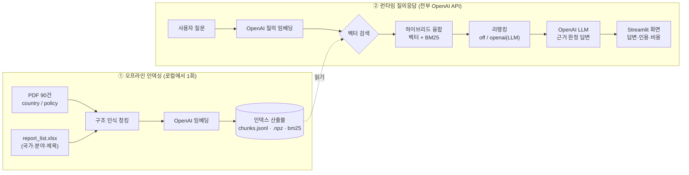
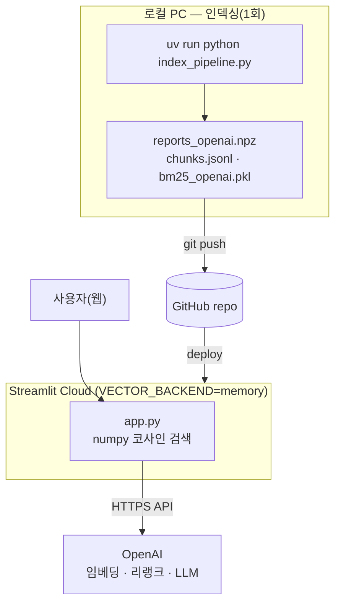
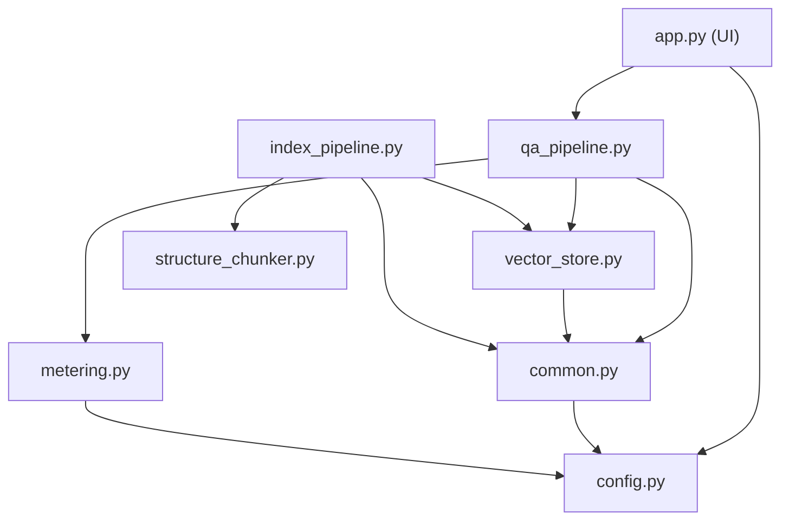

# 코네틱 국가별보고서 · 규제보고서 Q&A (RAG)

KEITI(코네틱) **환경 보고서 90건**(국가별 60 + 정책규제 30)을 대상으로 한
한국어 RAG(Retrieval-Augmented Generation) 질의응답 시스템입니다.
자연어로 질문하면 보고서 근거를 검색해 **출처·페이지를 인용한 답변**을 생성합니다.

> 설계 원칙: **임베딩·리랭크·LLM 을 전부 OpenAI API 로 처리**합니다(로컬 모델 없음).
> 덕분에 무거운 의존성(torch 등) 없이 Streamlit Cloud 무료티어에 그대로 배포됩니다.

---

## 1. 처음 보는 사람을 위한 30초 요약



- **검색**: 질문을 벡터로 바꿔 의미가 가까운 청크를 찾고(벡터), 키워드 일치(BM25)와 융합.
- **리랭킹**: 상위 후보를 LLM이 다시 정렬(선택, 끄기 가능).
- **생성**: LLM이 **검색된 근거 안에서만** 답하고 `[1][2]`로 인용.

---

## 2. 작업 환경 (Environment)

| 구분 | 내용 |
|------|------|
| OS | Windows 11 (macOS/Linux 동일 동작) |
| Python | 3.10–3.13 |
| 패키지 관리 | **uv** (`pyproject.toml`) · 클라우드는 `requirements.txt` |
| 런타임 의존성 | `streamlit`, `openai`, `numpy`, `rank-bm25`, `python-dotenv` |
| 인덱싱(로컬) 추가 | `pdfplumber`, `PyMuPDF`, `pandas`, `openpyxl`, `chromadb` (extra `indexing`) |
| LLM | OpenAI `gpt-5.4-nano` |
| 임베딩 | OpenAI `text-embedding-3-large` (3072d) |
| 리랭커 | OpenAI LLM 리스트와이즈 (또는 끄기) |
| 벡터 저장소 | `chroma`(로컬) / `memory`(numpy·배포) / `remote`(Chroma HTTP) |
| 비밀정보 | `OPENAI_API_KEY` → `.env`(로컬) / `st.secrets`(클라우드). **코드/깃 미포함** |
| 외부 인프라 | **불필요** (DB/Redis/검색엔진 없이 파일 + OpenAI API) |

원본 데이터(자동 로드): `…\ecolab\데이터\{country_report, policy_report}\*.pdf` + `report_list.xlsx`

---

## 3. 시스템 아키텍처

### 3-1. 교체형 지점
| 지점 | 환경변수 | 선택지 |
|------|----------|--------|
| 리랭킹 | `RERANK_BACKEND` | `off` · `openai` |
| 벡터 저장소 | `VECTOR_BACKEND` | `chroma` · `memory` · `remote` |

(임베딩·LLM 은 OpenAI 단일.)

### 3-2. 배포 토폴로지


### 3-3. 모듈 의존 관계


---

## 4. 모듈 구조 (엄밀 정의)

### 런타임(클라우드 포함)
| 모듈 | 책임 | 핵심 함수 |
|------|------|-----------|
| `config.py` | 설정 단일 출처. `.env`/secrets 로드, 백엔드·경로·가격표·로그레벨 | `collection_name()`, `bm25_path()`, `npz_path()`, `summary()` |
| `common.py` | OpenAI 임베딩, Chroma 클라이언트(로컬/원격), BM25 영속화, 토크나이저 | `embed_texts()`, `get_chroma_collection()`, `load_bm25()` |
| `vector_store.py` | 벡터 검색 추상화(`chroma`/`memory`/`remote` 동일 인터페이스) | `search()`, `save_npz()` |
| `metering.py` | 서버 로깅 + OpenAI 토큰·비용(USD) 추정 | `get_logger()`, `chat_cost()`, `embed_cost()` |
| `qa_pipeline.py` | 검색 → 리랭킹 → LLM 답변, 시간/토큰/비용 집계 | `hybrid_search()`, `rerank()`, `generate_answer()`, `answer()` |
| `app.py` | Streamlit UI(질의/답변·인용·비용 모니터). `st.secrets`→env 주입 | — |

### 오프라인 인덱싱(로컬, extra `indexing`)
| 모듈 | 책임 |
|------|------|
| `structure_chunker.py` | 구조 인식 파싱·청킹(pdfplumber 표/본문, 챕터/섹션, chunk_type, 컨텍스트 헤더) |
| `index_pipeline.py` | 엑셀↔PDF 매핑 → 청킹 → OpenAI 임베딩 → Chroma+BM25+npz 적재(오케스트레이터) |
| `build_openai_index.py` | `chunks.jsonl` 재사용해 임베딩만 재생성(재청킹 없이) |
| `export_npz.py` | 기존 Chroma 에서 npz 추출(재임베딩 없음) |

---

## 5. 실행 방법

### 로컬 (uv)
```bash
uv sync --extra indexing                 # 의존성 설치(런타임+인덱싱)

uv run python index_pipeline.py          # ① 인덱싱(청킹+OpenAI임베딩+적재) — 단일 명령

uv run streamlit run app.py              # ② 실행 → http://localhost:8501

# (선택) 클라우드와 동일 구성 점검
VECTOR_BACKEND=memory uv run streamlit run app.py
```

### Streamlit Cloud
`requirements.txt`(런타임 슬림) + `st.secrets`. 자세히는 **[DEPLOY.md](DEPLOY.md)**.

---

## 6. 모니터링 · 비용
- **서버 로그**(`metering`): 단계별 시간·토큰·비용을 `[rag]` 로 출력(`storage/streamlit.log`).
  `LOG_LEVEL=DEBUG` 로 상세화.
- **UI 모니터**: 질의별 시간/토큰/비용 + 세션 누적. 가격표는 `config.PRICES` 에서 조정.
- 참고 성능: 질의당 ≈14s(검색5·리랭크2·LLM7), ≈$0.0006.

---

## 7. 디렉터리 구조
```
rag_prototype/
├── app.py                  # Streamlit UI (질의응답)
├── config.py               # 설정(.env/secrets·경로·백엔드·가격·로그)
├── common.py               # OpenAI 임베딩/Chroma/BM25 공용 로더
├── vector_store.py         # 벡터 검색 추상화(chroma/memory/remote)
├── qa_pipeline.py          # 검색→리랭크→LLM + 비용집계
├── metering.py             # 로깅 + 토큰/비용 추정
├── structure_chunker.py    # 구조 인식 파싱·청킹
├── index_pipeline.py       # 오프라인 인덱싱(단일 명령)
├── build_openai_index.py   # 임베딩만 재빌드(청크 재사용)
├── export_npz.py           # Chroma→npz 추출
├── pyproject.toml          # uv 의존성(소스 오브 트루스)
├── requirements.txt        # Streamlit Cloud 런타임 슬림(미러)
├── DEPLOY.md               # 배포 가이드(A 인메모리 / C 원격서버)
├── .env(.example) / .streamlit/secrets.toml.example
└── storage/                # 인덱스 산출물(chunks.jsonl · *.npz · bm25 · chroma)
```

---

## 8. 동작 원리 메모(RAGFlow 대응)
- 하이브리드 융합 `final = 0.3·vector + 0.7·bm25` — RAGFlow `rag/nlp/search.py` 기본 가중치
- 청킹은 RAGFlow `naive_merge` 대신 보고서 구조(챕터/섹션/표/인터뷰)를 인식하도록 확장
- 인용은 RAGFlow `insert_citations` 를 축약
