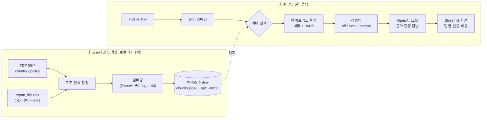
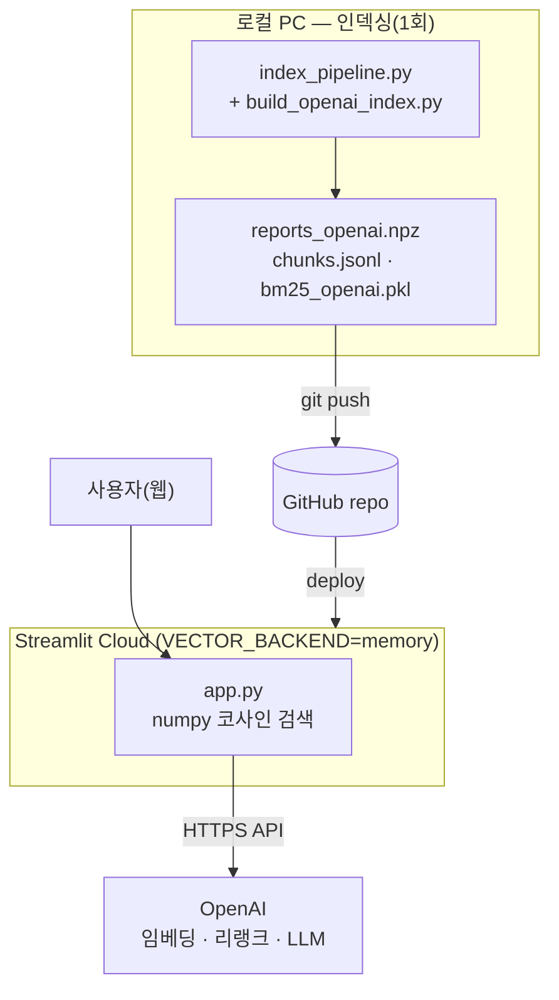
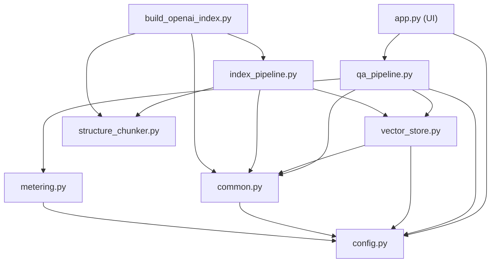

# 코네틱 국가별보고서 · 규제보고서 Q&A (RAG 프로토타입)

KEITI(코네틱) **환경 보고서 90건**(국가별 60 + 정책규제 30)을 대상으로 한
한국어 RAG(Retrieval-Augmented Generation) 질의응답 시스템입니다.
자연어로 질문하면 보고서 근거를 검색해 **출처·페이지를 인용한 답변**을 생성합니다.

> 핵심 설계: **모든 무거운 작업(임베딩·리랭크·LLM)을 OpenAI API로 처리**하여
> Streamlit Cloud 무료티어에 그대로 배포할 수 있습니다. 로컬 개발 시에는
> 비용 0의 로컬 모델(bge-m3)로도 동작하도록 **백엔드 교체형**으로 만들었습니다.

---

## 1. 처음 보는 사람을 위한 30초 요약



- **검색(Retrieval)**: 질문을 벡터로 바꿔 의미가 가까운 청크를 찾고(벡터), 키워드 일치(BM25)와 융합.
- **리랭킹(Rerank)**: 상위 후보를 다시 정렬해 정확도를 높임(선택).
- **생성(Generation)**: LLM이 **검색된 근거 안에서만** 답하고 `[1][2]`로 인용.

---

## 2. 작업 환경 (Environment)

| 구분 | 내용 |
|------|------|
| OS | Windows 11 |
| Python | 3.12 (3.10–3.13 호환) |
| 핵심 런타임 | `streamlit`, `openai`, `numpy`, `rank-bm25`, `python-dotenv` |
| 인덱싱(로컬) 추가 | `pdfplumber`, `PyMuPDF`, `pandas`, `openpyxl`, `chromadb`, (선택)`sentence-transformers`+`torch` |
| LLM | OpenAI `gpt-5.4-nano` (`.env`/secrets 에서 변경 가능) |
| 임베딩 | OpenAI `text-embedding-3-large`(3072d) 또는 로컬 `BAAI/bge-m3`(1024d) |
| 리랭커 | OpenAI LLM 리스트와이즈 또는 로컬 `BAAI/bge-reranker-v2-m3` |
| 벡터 저장소 | Chroma(로컬) / numpy 인메모리 / Chroma HTTP(원격) |
| 비밀정보 | `OPENAI_API_KEY` 는 `.env`(로컬) 또는 `st.secrets`(클라우드). **코드/깃에 미포함** |
| 외부 인프라 | **불필요** (DB/Redis/검색엔진 없이 파일 + API 만으로 동작) |

원본 데이터 위치(자동 로드, 업로드 불필요):
`C:\Users\jihyun\Desktop\KEITI_AD\ecolab\데이터`
( `country_report\`·`policy_report\` PDF + `report_list.xlsx` )

---

## 3. 시스템 아키텍처

### 3-1. 백엔드 교체형 구조 (핵심)
세 지점이 환경변수로 교체됩니다. **로컬은 비용 0/품질 비교**, **클라우드는 OpenAI 고정**.

| 지점 | 환경변수 | 선택지 | 비고 |
|------|----------|--------|------|
| 임베딩 | `EMBED_BACKEND` | `openai` · `bge-m3` | bge-m3 는 로컬 전용(torch 필요) |
| 리랭킹 | `RERANK_BACKEND` | `off` · `local` · `openai` | local 은 CPU 느림 → 클라우드는 openai |
| 벡터저장소 | `VECTOR_BACKEND` | `chroma` · `memory` · `remote` | memory=배포용 numpy, remote=원격 Chroma |

### 3-2. 배포 토폴로지

- 클라우드엔 **무거운 로컬 모델이 없음** → 벡터는 리포에 포함한 `.npz`를 메모리로 로드.
- bge-m3·로컬 리랭크는 `sentence-transformers` 미설치를 감지해 **UI에서 자동 숨김**(에러 방지).

### 3-3. 모듈 의존 관계


---

## 4. 모듈 구조 (엄밀 정의)

각 파일은 **단일 책임**을 갖도록 분리했습니다.

### 런타임(클라우드 포함)
| 모듈 | 책임 | 핵심 함수 |
|------|------|-----------|
| `config.py` | 전역 설정 단일 출처. `.env`/secrets 로드, 경로·모델·백엔드·가격표, 백엔드별 컬렉션/파일 경로 계산 | `collection_name()`, `bm25_path()`, `npz_path()` |
| `common.py` | 공용 리소스 로더(지연 import). 임베딩(openai/bge), Chroma 클라이언트(로컬/원격), BM25 영속화, 토크나이저 | `embed_texts()`, `get_chroma_collection()`, `load_bm25()` |
| `vector_store.py` | 벡터 검색 추상화. `chroma`/`memory`/`remote` 를 동일 인터페이스로 | `search()`, `save_npz()` |
| `metering.py` | 모니터링: 서버 로깅 + OpenAI 토큰·비용(USD) 추정 | `get_logger()`, `chat_cost()`, `embed_cost()` |
| `qa_pipeline.py` | ② 런타임 파이프라인: 하이브리드 검색 → 리랭킹(교체형) → LLM 답변, 시간/토큰/비용 집계 | `hybrid_search()`, `rerank()`, `generate_answer()`, `answer()` |
| `app.py` | Streamlit UI. 질의응답·임베딩 비교 모드, 백엔드 토글, 비용 모니터, 배포 가드 | — |

### 오프라인 인덱싱(로컬)
| 모듈 | 책임 | 핵심 함수 |
|------|------|-----------|
| `structure_chunker.py` | ②③ 구조 인식 파싱·청킹. pdfplumber로 표/본문 분리, 챕터/섹션/서브섹션·chunk_type 태깅, 널바이트 제거, 컨텍스트 헤더 | `parse_and_chunk()`, `context_text()` |
| `index_pipeline.py` | ① 엑셀↔PDF 매핑 → 청킹 → 임베딩 → Chroma+BM25+npz 적재(오케스트레이터) | `load_metadata()`, `build_index()`, `main()` |
| `build_openai_index.py` | `chunks.jsonl` 재사용해 OpenAI 임베딩 인덱스만 빠르게 생성 | `main()` |
| `export_npz.py` | 기존 Chroma 컬렉션에서 벡터를 추출해 `.npz` 저장(재임베딩 없음) | `main()` |

### 도구 / 비교
| 모듈 | 책임 |
|------|------|
| `compare_embeddings.py` | bge-m3 vs OpenAI 임베딩을 같은 질의로 CLI 비교 |

---

## 5. 데이터 흐름 ↔ 파이프라인 단계

| 단계 | 내용 | 담당 모듈 |
|------|------|-----------|
| ① 메타데이터·PDF 매핑 | 엑셀 2시트 읽고 파일명으로 PDF 연결 | `index_pipeline.load_metadata` |
| ② 파싱 | pdfplumber 표/본문 추출, 노이즈 제거 | `structure_chunker` |
| ③ 청킹 | 구조(챕터/섹션) 경계 + 메타데이터 결합 | `structure_chunker.parse_and_chunk` |
| ④ 임베딩 | 컨텍스트 헤더 결합 후 벡터화 | `common.embed_texts` |
| ⑤ 적재 | Chroma + BM25 + npz 영속화 | `index_pipeline.build_index` |
| ⑥ 검색 | 질의 임베딩 → 벡터+BM25 융합 | `qa_pipeline.hybrid_search` + `vector_store.search` |
| ⑦ 리랭킹 | 상위 N 재정렬(선택) | `qa_pipeline.rerank` |
| ⑧ 생성 | 근거 한정 답변 + 인용 | `qa_pipeline.generate_answer` |
| ⑨ 표시·모니터링 | 답변·근거·시간·비용 | `app.py` + `metering` |

---

## 6. 실행 방법

### 로컬 개발
```bash
pip install -r requirements.txt          # 전체(인덱싱 포함)

# 인덱싱 (1회) — 데이터 폴더 자동 사용
python index_pipeline.py                 # 청킹 → chunks.jsonl (+ bge-m3 인덱스)
EMBED_BACKEND=openai python build_openai_index.py   # OpenAI 임베딩 인덱스 + npz

# 실행
streamlit run app.py                     # http://localhost:8501

# (선택) 클라우드와 동일 구성으로 로컬 확인
VECTOR_BACKEND=memory EMBED_BACKEND=openai RERANK_BACKEND=openai streamlit run app.py
```

### Streamlit Cloud 배포
- `requirements-cloud.txt`(슬림, torch 없음) + `st.secrets`(OPENAI_API_KEY, `VECTOR_BACKEND=memory` 등)
- 자세한 절차는 **[DEPLOY.md](DEPLOY.md)** 참고.

---

## 7. 모니터링 · 비용

- **서버 로그**: 단계별 시간·토큰을 `metering` 로거가 출력(`storage/streamlit.log`).
  ```
  ② 임베딩(openai) 질의 1건 0.30s (tokens=34)
  ③ 리랭킹(openai): 20→5건 2.0s tokens=2880
  ④ 답변 완료 14.1s (검색 6.2 · 리랭크 2.0 · LLM 5.9) | 추정비용 $0.000595
  ```
- **UI 모니터**: 질의별 시간/토큰/비용 + 세션 누적 비용. 가격표는 `config.PRICES` 에서 조정.
- 참고 성능: 로컬 bge-reranker(CPU) ~131s → OpenAI 리랭크 ~14s (병목 해소).

---

## 8. 디렉터리 구조
```
rag_prototype/
├── app.py                  # ⑤ Streamlit UI (질의응답 · 임베딩 비교)
├── config.py               # 전역 설정(.env/secrets·경로·모델·백엔드·가격)
├── common.py               # 임베딩/Chroma/BM25 공용 로더
├── vector_store.py         # 벡터 검색 추상화(chroma/memory/remote)
├── qa_pipeline.py          # 런타임 검색→리랭크→LLM + 비용집계
├── metering.py             # 로깅 + 토큰/비용 추정
├── structure_chunker.py    # 구조 인식 파싱·청킹
├── index_pipeline.py       # 오프라인 인덱싱 오케스트레이터
├── build_openai_index.py   # OpenAI 임베딩 인덱스 빌더(청크 재사용)
├── export_npz.py           # Chroma→npz 추출(재임베딩 없음)
├── compare_embeddings.py   # bge-m3 vs OpenAI CLI 비교
├── requirements.txt / requirements-cloud.txt    # 전체 / 슬림(배포)
├── DEPLOY.md               # 배포 가이드(A 인메모리 / C 원격서버)
├── .env(.example) / .streamlit/secrets.toml.example
└── storage/                # 인덱스 산출물(chunks.jsonl · *.npz · bm25 · chroma)
```

---

## 9. 동작 원리 메모(RAGFlow 대응)
이 프로토타입은 RAGFlow의 핵심 개념을 외부 인프라 없이 축약한 것입니다.
- 하이브리드 융합 `final = 0.3·vector + 0.7·bm25` — RAGFlow `rag/nlp/search.py` 기본 가중치
- 청킹은 RAGFlow `naive_merge` 대신 보고서 구조를 인식하도록 확장
- 임베딩 `bge-m3` — RAGFlow `BuiltinEmbed` 와 동일 모델
